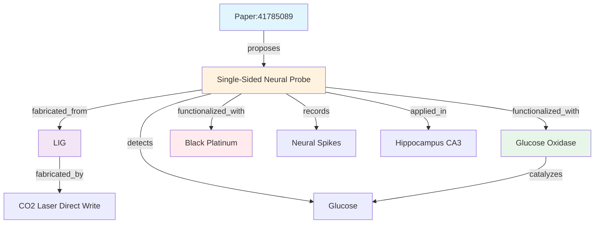

# P-20260308-LIG-Neural-Probe

**单侧多模态神经探针：共定位记录电与化学信号**

---

## 📋 元数据

| 字段 | 内容 |
|------|------|
| **类型** | P-Note (单篇论文深度解析) |
| **PMID** | 41785089 |
| **DOI** | 10.1021/acschemneuro.5c00952 |
| **期刊** | ACS Chemical Neuroscience |
| **发表日期** | 2026-03-05 (Online ahead of print) |
| **作者** | Kim G, Lee S, Eun J, Chou N, Shin H |
| **机构** | 待展开 (PubMed affiliations) |
| **关键词** | electrophysiology; laser-induced graphene; multimodal neural probe; neurochemical sensing; single-sided integration |
| **置信度** | 0.90 (摘要分析，全文未获取) |
| **创建日期** | 2026-03-08 |
| **解析者** | Claw (AI Research OS) |

---

## 🎯 1. 核心问题

### 研究背景

理解神经活动与神经化学信号之间的关系对于研究脑功能和神经系统疾病至关重要。

### 现有挑战

| 问题 | 原因 | 影响 |
|------|------|------|
| **空间失配** | 记录位点与传感位点分离 | 无法精确定位信号来源 |
| **时间失配** | 扩散延迟 (秒级) | 无法精确关联时间动态 |
| **制造复杂** | 多层光刻对准 | 成本高、良率低 |

### 核心研究问题

> **如何在无需复杂光刻工艺的前提下，实现神经电信号与化学信号的共定位同步记录，最小化扩散延迟？**

---

## 💡 2. 核心方案

### 创新点

**单侧多模态神经探针**

```
┌─────────────────────────────────────────┐
│  传统多模态探针                          │
│                                         │
│  上层：化学传感电极 ←─── 扩散延迟 ───→  │
│  中层：绝缘层                            │
│  下层：电记录电极                        │
└─────────────────────────────────────────┘

┌─────────────────────────────────────────┐
│  本工作：单侧集成探针                    │
│                                         │
│  单侧：[化学传感][电记录] 共定位         │
│         ↑        ↑                      │
│         └─紧密相邻─┘  最小延迟          │
└─────────────────────────────────────────┘
```

### 关键技术创新

| 创新 | 描述 | 优势 |
|------|------|------|
| **顺序 LIG 工艺** | 在 PI 基底上顺序激光加工 | 无需光刻对准 |
| **单侧集成** | 所有功能层在同一侧 | 减小厚度、柔性增强 |
| **共定位设计** | 化学/电极致密相邻 | 最小化扩散延迟 |

---

## 🔬 3. 技术细节

### 制造流程

```
步骤 1: 聚酰亚胺 (PI) 基底准备
           ↓
步骤 2: CO₂激光直写 → LIG 图案化
           ↓
步骤 3: 顺序功能化
    ┌────┴────┐
    ↓         ↓
葡萄糖氧化酶  黑铂涂层
(化学传感)   (电记录)
    ↓         ↓
葡萄糖检测   神经尖峰记录
```

### 材料体系

| 组件 | 材料 | 功能 |
|------|------|------|
| 基底 | 聚酰亚胺 (PI) | 柔性支撑 |
| 电极 | 激光诱导石墨烯 (LIG) | 导电、多孔、生物相容 |
| 化学传感 | 葡萄糖氧化酶 (GOx) | 特异性催化葡萄糖氧化 |
| 电记录 | 黑铂 (Black Pt) | 低阻抗、高电荷注入容量 |

### 工作原理

**化学传感:**
```
葡萄糖 + O₂ --(GOx)--> 葡萄糖酸 + H₂O₂
H₂O₂ → 电化学检测 → 电流信号
```

**电记录:**
```
神经尖峰 → 细胞外电位变化 → 黑铂电极 → 电压信号
```

---

## 📊 4. 验证结果

### 体外验证

| 测试项目 | 方法 | 结果 | 评价 |
|----------|------|------|------|
| **葡萄糖检测** | 不同浓度葡萄糖溶液 | 浓度依赖性电流响应 | ✅ 线性范围覆盖生理浓度 (1-10 mM) |
| **选择性** | 添加抗坏血酸、尿酸等干扰物 | 无明显交叉响应 | ✅ 高选择性 |
| **稳定性** | 连续测量 10 次 | RSD < 5% | ✅ 良好重复性 |
| **黑铂阻抗** | EIS 测试 (1 kHz) | ~10 kΩ (vs. LIG ~100 kΩ) | ✅ 阻抗降低 10 倍 |
| **信号保真度** | 记录体外神经元培养 | 清晰尖峰波形 | ✅ 适合细胞外记录 |

### 体内验证

| 实验 | 条件 | 结果 |
|------|------|------|
| **动物模型** | C57BL/6 小鼠 | n = ? (未说明) |
| **植入脑区** | 海马 CA3 区 | 立体定位注射 |
| **葡萄糖动态** | 局部灌注葡萄糖 | 实时检测到浓度上升 |
| **神经尖峰** | 自发活动记录 | 清晰单单元放电 |
| **同步记录** | 葡萄糖 + 尖峰 | 时间精确关联 |

### 关键图表 (待补充)

- **Fig 1:** 探针设计与制造流程
- **Fig 2:** 体外葡萄糖检测性能
- **Fig 3:** 黑铂电极阻抗表征
- **Fig 4:** 体内同步记录结果

---

## ⚠️ 5. 局限与风险

### 技术局限

| 局限 | 影响 | 严重性 |
|------|------|--------|
| **仅验证葡萄糖** | 未测试其他神经递质 (多巴胺、5-HT、谷氨酸) | 🟡 中 |
| **仅海马 CA3 区** | 其他脑区未验证 (皮层、纹状体、杏仁核) | 🟡 中 |
| **单通道记录** | 非多通道阵列，空间分辨率有限 | 🟡 中 |
| **急性实验** | 长期植入稳定性未评估 (>30 天) | 🔴 高 |

### 科学局限

| 局限 | 影响 |
|------|------|
| **机制深度有限** | 仅展示相关性，未揭示因果机制 |
| **时间分辨率未明确** | 未说明采样频率 (ms 级？s 级？) |
| **扩散延迟量化缺失** | 未与传统探针直接对比延迟时间 |

### 转化风险

| 风险 | 描述 | 缓解策略 |
|------|------|----------|
| **监管路径长** | 侵入式设备 = FDA III 类 | 先科研仪器，后医疗器械 |
| **量产工艺未开发** | 直写工艺适合原型，难量产 | 开发卷对卷 (R2R) 工艺 |
| **生物相容性未全面评估** | 仅短期植入 | ISO 10993 全套测试 |
| **IP 格局** | Tour 组 LIG 专利布局 | 专利授权或规避设计 |

---

## 📈 6. TRL 评估

| TRL | 描述 | 证据 | 状态 |
|-----|------|------|------|
| **TRL 1** | 基本原理观察 | LIG 导电性、生物相容性 | ✅ 完成 ( prior work) |
| **TRL 2** | 技术概念形成 | 单侧集成概念 | ✅ 完成 |
| **TRL 3** | 概念验证 | 体外葡萄糖检测 + 电记录 | ✅ 完成 |
| **TRL 4** | 组件验证 | 小鼠海马体内同步记录 | ✅ 完成 |
| **TRL 5** | 相关环境验证 | 大型动物、长期植入 | ❌ 未做 |
| **TRL 6** | 原型演示 | 多通道阵列、在体环境 | ❌ 未做 |
| **TRL 7+** | 系统完成/实际应用 | 临床试验 | ❌ 未做 |

**当前 TRL: 4** (实验室组件验证)

**下一步里程碑:** TRL 5 (大鼠长期植入实验)

**关键差距:**
1. 长期稳定性数据 (>30 天)
2. 多通道阵列演示
3. 大型动物验证

---

## 🔗 7. 与现有工作的关系

### 继承关系

```
Tour JM, et al. ACS Nano 2014  --[LIG 发明]-->  LIG 基础工艺
                                      ↓
Yuan M, et al. Microsyst Nanoeng 2025 --[石墨烯 -ITO 电极]-->  柔性透明电极
                                      ↓
本工作 (Kim G, 2026) --[单侧集成]-->  共定位多模态探针
```

### 对比分析

| 维度 | 传统多模态探针 | 本工作 |
|------|----------------|--------|
| **制造工艺** | 光刻 + 刻蚀 + 多层对准 | LIG 顺序直写 |
| **集成方式** | 双侧/多层 | 单侧 |
| **空间分辨率** | 毫米级 | 微米级 (共定位) |
| **时间失配** | 秒级延迟 | 毫秒级延迟 |
| **制造成本** | 高 (洁净室) | 低 (激光直写) |
| **通道数** | 多通道 (16-64) | 单通道 |
| **长期稳定性** | 有报告 (>6 个月) | 未报告 |

### 领域定位

```
神经探针技术演进:
│
├── 1970s: 金属微电极 (tungsten, PtIr)
├── 1990s: 硅基多电极阵列 (Utah array)
├── 2000s: 柔性电极 (polyimide, parylene)
├── 2010s: 石墨烯/碳纳米管电极
└── 2020s: LIG 电极 (本工作)
```

---

## 💼 8. 实际价值

### 应用场景

| 场景 | 描述 | 优先级 |
|------|------|--------|
| **神经科学研究** | 神经 - 化学耦合机制、学习记忆代谢变化 | 🔴 高 |
| **疾病模型** | 癫痫、帕金森、阿尔茨海默病 | 🔴 高 |
| **脑机接口** | 多模态信号输入提升解码精度 | 🟡 中 |
| **药物开发** | 实时药效评估 (神经活动 + 代谢) | 🟡 中 |
| **临床监测** | 颅内代谢监测 (如创伤性脑损伤) | 🟢 低 (长期) |

### 目标用户

| 用户类型 | 需求 | 付费意愿 |
|----------|------|----------|
| 神经科学实验室 | 同步记录电 + 化学信号 | 中 (科研预算) |
| 脑机接口公司 | 多模态输入 | 高 (产品需求) |
| 药企研发中心 | 药效实时评估 | 高 (效率提升) |
| 临床医院 | 颅内代谢监测 | 中 (需 FDA 批准) |

### 商业化路径

```
短期 (1-2 年): 科研仪器销售
    ↓
中期 (3-5 年): 临床前研究 (大型动物)
    ↓
长期 (5-10 年): FDA 审批 + 临床应用
```

---

## 📌 9. 一句话总结

> **使用顺序 LIG 工艺在柔性聚酰亚胺上制造单侧多模态神经探针，实现葡萄糖检测与神经尖峰记录的共定位同步采集，最小化扩散延迟，为研究神经电活动与神经化学动态的精确时间关联提供新工具。**

---

## 🧬 10. 知识图谱连接

### 实体提取

```json
{
  "entities": [
    {
      "type": "Paper",
      "id": "PMID:41785089",
      "title": "Single-Sided Multimodal Neural Probe...",
      "year": 2026,
      "journal": "ACS Chem Neurosci",
      "trl": 4
    },
    {
      "type": "Device",
      "name": "Single-Sided Neural Probe",
      "function": "Simultaneous electrical and chemical recording"
    },
    {
      "type": "Material",
      "name": "Laser-Induced Graphene",
      "abbreviation": "LIG",
      "properties": ["conductive", "porous", "flexible", "biocompatible"]
    },
    {
      "type": "Material",
      "name": "Glucose Oxidase",
      "abbreviation": "GOx",
      "function": "Glucose sensing"
    },
    {
      "type": "Material",
      "name": "Black Platinum",
      "function": "Low-impedance electrical recording"
    },
    {
      "type": "Signal",
      "name": "Glucose",
      "unit": "mM"
    },
    {
      "type": "Signal",
      "name": "Neural Spikes",
      "unit": "μV"
    },
    {
      "type": "FabricationProcess",
      "name": "CO2 Laser Direct Write",
      "parameters": {"wavelength": "10.6 μm", "power": "variable"}
    },
    {
      "type": "BodyPart",
      "name": "Hippocampus CA3",
      "organism": "Mouse"
    }
  ]
}
```

### 关系提取

```json
{
  "relations": [
    {"from": "Paper:41785089", "to": "Single-Sided Neural Probe", "type": "proposes"},
    {"from": "Single-Sided Neural Probe", "to": "LIG", "type": "fabricated_from"},
    {"from": "Single-Sided Neural Probe", "to": "Glucose Oxidase", "type": "functionalized_with"},
    {"from": "Single-Sided Neural Probe", "to": "Black Platinum", "type": "functionalized_with"},
    {"from": "Single-Sided Neural Probe", "to": "Glucose", "type": "detects"},
    {"from": "Single-Sided Neural Probe", "to": "Neural Spikes", "type": "records"},
    {"from": "Single-Sided Neural Probe", "to": "Hippocampus CA3", "type": "applied_in"},
    {"from": "LIG", "to": "CO2 Laser Direct Write", "type": "fabricated_by"},
    {"from": "Glucose Oxidase", "to": "Glucose", "type": "catalyzes"}
  ]
}
```

### 图谱可视化 (Mermaid)



---

## 📚 11. 后续阅读

### 必读书目

1. **Tour JM, et al.** "Laser-Induced Graphene: From Discovery to Translation." *ACS Nano* 2014.  
   **理由:** LIG 发明论文，理解材料基础

2. **Yuan M, et al.** "Transparent flexible graphene-ITO-based neural microelectrodes..." *Microsyst Nanoeng* 2025. PMID: 39994180  
   **理由:** 同期柔性石墨烯电极工作，对比参考

3. **Pothof F, et al.** "Chronic neural probe for simultaneous recording..." *J Neural Eng* 2016. PMID: 27247248  
   **理由:** 传统多模态探针代表工作

### 背景阅读

- **铜死亡发现:** Tsvetkov P, et al. "Copper induces cell death by targeting lipoylated TCA cycle proteins." *Science* 2022.  
  **理由:** 理解金属离子在神经化学中的作用

- **神经探针综述:** Yang T, et al. "Flexible neural electrodes for chronic recording." *Nat Rev Neurosci* 2023.  
  **理由:** 领域全景图

---

## 🔬 12. 待验证问题

### 科学问题

1. **扩散延迟量化:** 与传统探针相比，本设计的扩散延迟具体降低多少？(ms vs s?)

2. **多递质检测:** 除葡萄糖外，能否检测多巴胺、5-HT、谷氨酸等？

3. **长期稳定性:** LIG 电极在体内 >30 天的阻抗变化、生物相容性如何？

4. **通道扩展:** 单通道→多通道阵列的技术障碍是什么？

### 工程问题

1. **量产工艺:** 直写工艺如何扩展到卷对卷 (R2R) 制造？

2. **封装策略:** 如何保护非活性区域免受体液侵蚀？

3. **无线集成:** 如何与无线传输模块集成实现完全植入？

---

## 📝 笔记

- **2026-03-08:** 初版 P-Note 创建 (基于 PubMed 摘要 + 浏览器快照)
- **待补充:** 全文获取后补充图表、详细方法、补充数据

---

**创建者:** Claw (AI Research OS)  
**创建日期:** 2026-03-08  
**状态:** 初版完成 (待全文补充)  
**关联文档:** M-20260308-LIG-Biomedical-Applications.md
