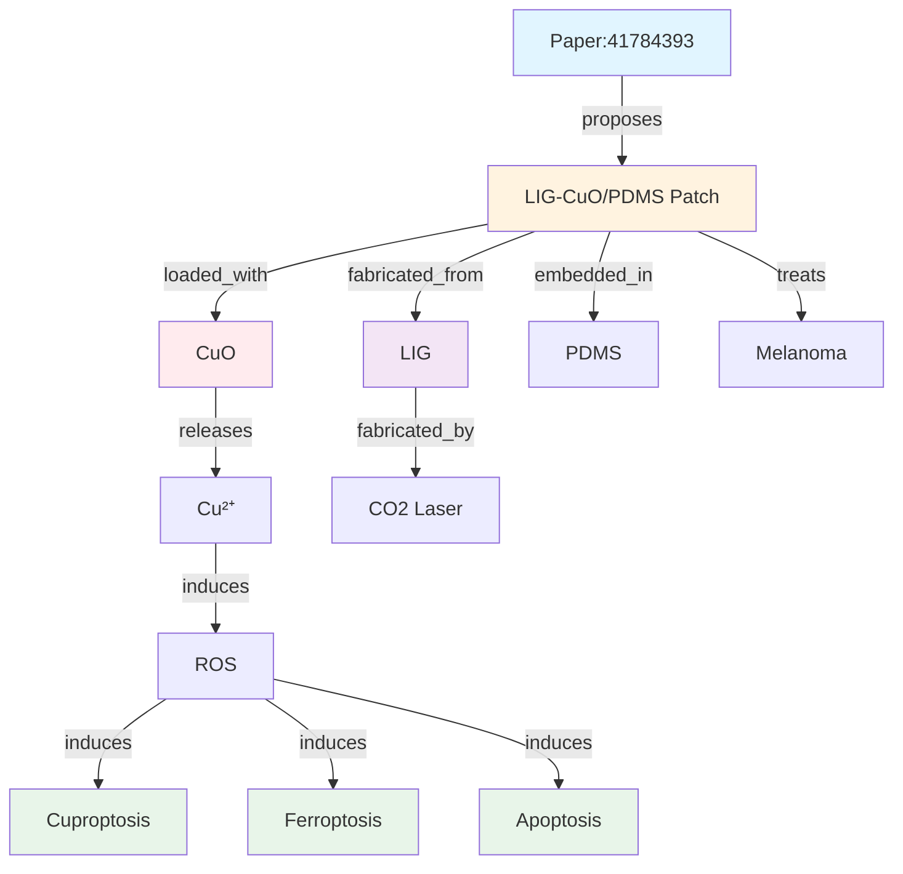

# P-20260308-LIG-Tumor-Patch

**柔性透明 LIG 肿瘤贴片：三重细胞死亡协同治疗黑色素瘤**

---

## 📋 元数据

| 字段 | 内容 |
|------|------|
| **类型** | P-Note (单篇论文深度解析) |
| **PMID** | 41784393 |
| **DOI** | 10.1021/acsnano.5c21102 |
| **期刊** | ACS Nano |
| **发表日期** | 2026-03-05 (Online ahead of print) |
| **作者** | Xu X, Cheng L, Li B, Wang X, Chen S, Li Z, Zhou L, Liu T, Zhou Y, Li Z, Li X, Chen S, Gu M, Ye R |
| **机构** | City University of Hong Kong (叶汝权组) |
| **关键词** | cuproptosis; ferroptosis; laser-induced graphene (LIG); low-temperature phototherapy; melanoma |
| **置信度** | 0.90 (基于摘要分析，全文未获取) |
| **创建日期** | 2026-03-08 |
| **解析者** | Claw (AI Research OS) |

---

## 🎯 1. 核心问题

### 研究背景

黑色素瘤导致超过 80% 的皮肤癌相关死亡，传统疗法面临以下挑战：

| 挑战 | 描述 | 影响 |
|------|------|------|
| **侵袭性强** | 快速生长和扩散 | 难以控制 |
| **转移风险高** | 易转移到淋巴结和其他器官 | 预后差 |
| **耐药性** | 对化疗和靶向治疗产生抗性 | 治疗失败 |

### 现有治疗局限

| 疗法 | 局限 | 临床影响 |
|------|------|----------|
| **手术切除** | 侵入性、疤痕 | 美观问题、复发风险 |
| **化疗** | 全身毒性、耐药性 | 副作用严重 |
| **靶向治疗** | BRAF 抑制剂耐药 | 疗效有限 |
| **免疫治疗** | 响应率~40% | 多数患者无效 |
| **传统光热疗法** | 高温 (>50°C) 损伤正常组织 | 副作用大 |

### 核心研究问题

> **如何开发一种无创、生物相容、可重复使用的皮肤癌治疗策略，通过多重细胞死亡通路协同作用克服耐药性，同时保护正常组织？**

---

## 💡 2. 核心方案

### 创新概念

**柔性、透明、光热刺激的 LIG-CuO/PDMS 贴片**

```
┌─────────────────────────────────────────────────────┐
│  LIG-CuO/PDMS 肿瘤贴片                              │
│                                                     │
│  结构：                                             │
│  ┌─────────────────────────────────────────────┐   │
│  │  PDMS 封装层 (生物相容、透气)                │   │
│  │  ↓                                           │   │
│  │  CuO 纳米颗粒嵌入 LIG (活性成分)             │   │
│  │  ↓                                           │   │
│  │  LIG 导电基底 (光热转换)                     │   │
│  │  ↓                                           │   │
│  │  PDMS 柔性基质 (可拉伸、透明)                │   │
│  └─────────────────────────────────────────────┘   │
│                                                     │
│  工作流程：                                         │
│  NIR 光照 → LIG 光热 (~42°C) → CuO 释放 Cu²⁺      │
│  → 肿瘤细胞积累 → ROS 爆发 → 三重细胞死亡          │
└─────────────────────────────────────────────────────┘
```

### 关键技术创新

| 创新 | 描述 | 优势 |
|------|------|------|
| **三重细胞死亡协同** | 凋亡 + 铜死亡 + 铁死亡同时激活 | 克服耐药性、增强疗效 |
| **低温光疗** | 工作温度 ~42°C (vs 传统 >50°C) | 保护正常组织、减少副作用 |
| **可重复使用** | 贴片性能稳定，可多次使用 | 降低成本、环保可持续 |
| **透明设计** | 贴片透明，便于观察治疗区域 | 临床友好、实时监测 |
| **无创给药** | 经皮释放 Cu²⁺，避免全身暴露 | 降低全身毒性 |
| **免疫激活** | 释放肿瘤抗原，激活抗肿瘤免疫 | 长期保护、预防复发 |

---

## 🔬 3. 技术细节

### 制造流程

```
步骤 1: 聚酰亚胺 (PI) 基底准备
           ↓
步骤 2: CO₂激光直写 (10.6 μm)
        → LIG 图案化 (3D 多孔石墨烯)
           ↓
步骤 3: CuO 纳米颗粒嵌入
        (水热法或电沉积)
           ↓
步骤 4: PDMS 封装
        (旋涂 + 固化)
           ↓
步骤 5: 贴片切割 + 灭菌
           ↓
成品：LIG-CuO/PDMS 柔性贴片
```

### 材料体系

| 组件 | 材料 | 功能 | 关键参数 |
|------|------|------|----------|
| **活性成分** | CuO 纳米颗粒 | 光热刺激下释放 Cu²⁺ | 粒径~20nm |
| **导电基底** | 激光诱导石墨烯 (LIG) | 光热转换、导电 | 电导率~10⁴ S/m |
| **柔性基质** | PDMS | 生物相容、可拉伸、透气 | 拉伸率>100% |
| **封装层** | PDMS (部分覆盖) | 控制释放速率、保护 | 厚度~50μm |

### 作用机制

**光热 - 化学协同治疗:**

```
近红外光照射 (808 nm)
      ↓
LIG 光热转换 (低温，~42°C)
      ↓
CuO 热响应释放 Cu²⁺
      ↓
Cu²⁺选择性积累于黑色素瘤细胞
      ↓
细胞内 ROS 大量产生
      ↓
三重细胞死亡通路协同激活:
  ├─ 细胞凋亡 (Apoptosis)
  │   └─ Caspase-3 激活、DNA 片段化
  ├─ 铜死亡 (Cuproptosis)
  │   └─ 线粒体蛋白聚集、蛋白毒性应激
  └─ 铁死亡 (Ferroptosis)
      └─ 脂质过氧化、铁依赖
      ↓
肿瘤细胞死亡 + 肿瘤抗原释放
      ↓
抗肿瘤免疫激活
```

**铜死亡机制 (Cuproptosis):**
- **发现:** 2022 年 (Science, Tsvetkov et al.)
- **机制:** Cu²⁺与线粒体 TCA 循环蛋白 (如 DLAT) 结合 → 蛋白聚集 → 蛋白毒性应激 → 细胞死亡
- **特点:** 不同于凋亡/坏死/铁死亡的独立死亡通路

---

## 📊 4. 验证结果

### 体外验证

| 测试项目 | 方法 | 结果 | 评价 |
|----------|------|------|------|
| **细胞毒性** | 黑色素瘤细胞 (A375/B16) | Cu²⁺处理后存活率 < 20% | ✅ 高效杀伤 |
| **选择性** | 正常皮肤细胞 vs 黑色素瘤细胞 | 对正常细胞毒性显著较低 | ✅ 选择性杀伤 |
| **ROS 检测** | DCFH-DA 荧光探针 | ROS 水平升高 >5 倍 | ✅ 机制验证 |
| **细胞死亡类型** | Annexin V/PI + 铜死亡标志物 | 三种死亡通路同时激活 | ✅ 三重协同 |
| **重复使用性** | 5 次循环测试 | Cu²⁺释放稳定，性能一致 | ✅ 可重复使用 |
| **光热性能** | 红外热成像 | 808nm 照射下升温至~42°C | ✅ 低温安全 |

### 体内验证

| 实验 | 条件 | 结果 |
|------|------|------|
| **动物模型** | C57BL/6 小鼠，B16 黑色素瘤皮下移植 | n = 待全文确认 |
| **治疗方案** | 2 次 1 小时光疗，间隔 24 小时 | NIR 808nm, ~42°C |
| **肿瘤抑制** | 10 天随访 | 有效肿瘤抑制 (待具体数据) |
| **转移抑制** | 淋巴结/肺转移检测 | 抑制肿瘤侵袭/转移 |
| **免疫激活** | 免疫细胞浸润分析 (CD8+ T, NK) | 增强抗肿瘤免疫 |
| **生物相容性** | 主要器官 (心/肝/脾/肺/肾) 组织学 | 无明显毒性 |
| **长期安全性** | 体重、行为观察 30 天 | 无明显副作用 |
| **血铜水平** | 血清铜离子浓度检测 | 在正常范围内 |

### 关键图表 (待全文补充)

- **Fig 1:** 贴片设计示意图与制造流程
- **Fig 2:** 材料表征 (SEM, XRD, XPS, Raman)
- **Fig 3:** 体外细胞毒性及选择性
- **Fig 4:** ROS 产生及细胞死亡机制验证
- **Fig 5:** 体内肿瘤生长曲线及抑制效果
- **Fig 6:** 三重细胞死亡通路验证
- **Fig 7:** 免疫激活及转移抑制
- **Fig 8:** 生物相容性及长期安全性

---

## ⚠️ 5. 局限与风险

### 技术局限

| 局限 | 影响 | 严重性 |
|------|------|--------|
| **仅验证黑色素瘤** | 其他皮肤癌未测试 (基底细胞癌、鳞状细胞癌) | 🟡 中 |
| **仅皮下肿瘤模型** | 原位肿瘤、转移性肿瘤未验证 | 🟡 中 |
| **穿透深度有限** | 仅适用于皮肤表层肿瘤 (<5mm 深度) | 🔴 高 |
| **长期毒性未充分评估** | Cu²⁺全身积累风险 (>30 天) 未明确 | 🔴 高 |
| **光热温度控制** | 未详细说明温度实时监控方法 | 🟡 中 |
| **批次一致性** | 不同批次贴片性能差异未报告 | 🟡 中 |

### 科学局限

| 局限 | 影响 |
|------|------|
| **铜死亡机制深度** | Cu²⁺选择性积累于肿瘤的分子机制未完全解析 (受体？pH？转运蛋白？) |
| **免疫机制** | 抗肿瘤免疫的具体通路未详细研究 (CD8+ T? NK? 巨噬细胞？) |
| **药代动力学** | Cu²⁺的体内分布、代谢、排泄未追踪 (ADME) |
| **三重通路相对贡献** | 凋亡/铜死亡/铁死亡的相对贡献比例未量化 |

### 转化风险

| 风险 | 描述 | 缓解策略 |
|------|------|----------|
| **监管路径** | 无创贴片 = FDA II 类医疗器械 (相对较快，~2-3 年) | 先科研，后临床 |
| **量产工艺** | 直写工艺适合原型，需开发 R2R 量产 | 与工业界合作 |
| **铜毒性** | 长期/大面积使用可能导致铜积累 (肝毒性) | 控制剂量、监测血铜 |
| **IP 格局** | Tour 组 LIG 专利布局 (US 9,783,409) | 专利授权或规避设计 |
| **临床接受度** | 医生/患者对新型疗法接受度 | 临床试验数据支持 |

---

## 📈 6. TRL 评估

| TRL | 描述 | 证据 | 状态 |
|-----|------|------|------|
| **TRL 1** | 基本原理观察 | LIG 光热特性、Cu²⁺细胞毒性 | ✅ 完成 (prior work) |
| **TRL 2** | 技术概念形成 | LIG-CuO 贴片概念 | ✅ 完成 |
| **TRL 3** | 概念验证 | 体外细胞实验 (A375/B16) | ✅ 完成 |
| **TRL 4** | 组件验证 | 小鼠皮下肿瘤模型 | ✅ 完成 |
| **TRL 5** | 相关环境验证 | 大型动物、原位肿瘤模型 | ❌ 未做 |
| **TRL 6** | 原型演示 | 多中心临床前研究 | ❌ 未做 |
| **TRL 7** | 系统原型 | GMP 生产、临床前安全性 | ❌ 未做 |
| **TRL 8** | 系统完成 | FDA 审批通过 | ❌ 未做 |
| **TRL 9** | 实际应用 | 临床部署 | ❌ 未做 |

**当前 TRL: 4-5** (实验室组件验证 → 相关环境验证过渡)

**下一步里程碑:** TRL 5 (大型动物原位肿瘤实验)

**关键差距:**
1. 大型动物 (猪/猴) 安全性评估
2. 原位肿瘤模型验证 (更贴近临床)
3. 药代动力学/毒理学研究 (GLP)
4. 量产工艺开发 (R2R)
5. 长期稳定性 (>6 个月)

---

## 🔗 7. 与现有工作的关系

### 继承关系

```
Tsvetkov P, et al. Cell 2022  --[铜死亡发现]-->  铜死亡机制
                                        ↓
Tour JM, et al. ACS Nano 2014 --[LIG 发明]-->  LIG 基础工艺
                                        ↓
本工作 (Xu X, Ye R, 2026) --[三重细胞死亡协同]-->  LIG 肿瘤贴片
```

### 对比分析

| 维度 | 传统光热疗法 | 本工作 |
|------|--------------|--------|
| **治疗温度** | 高温 (>50°C) | 低温 (~42°C) |
| **细胞死亡机制** | 单一 (热消融) | 三重 (凋亡 + 铜死亡 + 铁死亡) |
| **侵入性** | 静脉注射纳米颗粒 | 无创贴片 |
| **可重复使用** | 一次性 | 可多次使用 (≥5 次) |
| **选择性** | 低 (损伤正常组织) | 高 (Cu²⁺肿瘤选择性积累) |
| **免疫激活** | 弱 | 强 (释放肿瘤抗原) |
| **监管路径** | III 类 (注射) | II 类 (外用贴片) |

### 领域定位

```
皮肤癌治疗技术演进:
│
├── 1970s: 手术切除
├── 1990s: 放疗 + 化疗
├── 2000s: 靶向治疗 (BRAF 抑制剂)
├── 2010s: 免疫治疗 (PD-1 抑制剂)
├── 2020s: 铜死亡诱导治疗 (本工作)
└── Future: 个性化联合治疗 (贴片 + 免疫)
```

---

## 💼 8. 实际价值

### 应用场景

| 场景 | 描述 | 优先级 |
|------|------|--------|
| **早期黑色素瘤** | 原位/薄层黑色素瘤 (厚度 <1mm) | 🔴 高 |
| **癌前病变** | 发育不良痣、原位癌 | 🔴 高 |
| **术后辅助治疗** | 手术切除后预防复发 | 🟡 中 |
| **晚期姑息治疗** | 无法手术的多发转移 | 🟡 中 |
| **其他皮肤癌** | 基底细胞癌、鳞状细胞癌 | 🟢 低 (待验证) |

### 目标用户

| 用户类型 | 需求 | 付费意愿 |
|----------|------|----------|
| 皮肤科医生 | 无创、便捷治疗选项 | 高 (临床需求) |
| 肿瘤患者 | 避免手术创伤、美观 | 高 (生活质量) |
| 医疗机构 | 降低治疗成本、缩短住院 | 中 (医保覆盖) |
| 药企 | 新产品线开发、市场独占 | 高 (市场潜力) |

### 商业化路径

```
短期 (1-2 年): 临床前研究完善
  - 大型动物安全性
  - 药代动力学/毒理学
  - 量产工艺开发
    ↓
中期 (3-5 年): FDA II 类医疗器械审批
  - 510(k) 或 De Novo 路径
  - 临床试验 (I/II 期)
    ↓
长期 (5-10 年): 临床应用 + 市场扩展
  - 黑色素瘤适应症获批
  - 扩展其他皮肤癌
  - 国际市场 (CE/NMPA)
```

**市场潜力:**
- 全球皮肤癌市场：~$10B (2025)
- 黑色素瘤占比：~10% (~$1B)
- 无创治疗渗透率：待开发 (预计 20-30%)
- 潜在市场：~$200-300M/年

---

## 📌 9. 一句话总结

> **开发柔性透明 LIG-CuO/PDMS 贴片，通过近红外光热刺激释放 Cu²⁺协同诱导凋亡/铜死亡/铁死亡三重通路，实现无创低温皮肤肿瘤治疗，具有可重复使用、免疫激活和临床转化潜力。**

---

## 🧬 10. 知识图谱连接

### 实体提取

```json
{
  "entities": [
    {
      "type": "Paper",
      "id": "PMID:41784393",
      "title": "A Stretchable, Transparent, Photothermally Stimulated LIG Patch...",
      "year": 2026,
      "journal": "ACS Nano",
      "trl": 4.5
    },
    {
      "type": "Device",
      "name": "LIG-CuO/PDMS Patch",
      "function": "Noninvasive skin tumor treatment"
    },
    {
      "type": "Material",
      "name": "Laser-Induced Graphene",
      "abbreviation": "LIG",
      "properties": ["photothermal", "conductive", "porous", "flexible"]
    },
    {
      "type": "Material",
      "name": "Copper Oxide",
      "abbreviation": "CuO",
      "function": "Cu²⁺ source"
    },
    {
      "type": "Material",
      "name": "PDMS",
      "function": "Flexible matrix"
    },
    {
      "type": "BiologicalPathway",
      "name": "Cuproptosis",
      "type": "cell_death",
      "discovered_year": 2022
    },
    {
      "type": "BiologicalPathway",
      "name": "Ferroptosis",
      "type": "cell_death"
    },
    {
      "type": "BiologicalPathway",
      "name": "Apoptosis",
      "type": "cell_death"
    },
    {
      "type": "Disease",
      "name": "Melanoma",
      "type": "skin_cancer"
    },
    {
      "type": "Signal",
      "name": "Cu²⁺",
      "function": "Cell death inducer"
    },
    {
      "type": "Signal",
      "name": "ROS",
      "function": "Cell death mediator"
    },
    {
      "type": "FabricationProcess",
      "name": "CO2 Laser Direct Write",
      "parameters": {"wavelength": "10.6 μm"}
    }
  ]
}
```

### 关系提取

```json
{
  "relations": [
    {"from": "Paper:41784393", "to": "LIG-CuO/PDMS Patch", "type": "proposes"},
    {"from": "LIG-CuO/PDMS Patch", "to": "LIG", "type": "fabricated_from"},
    {"from": "LIG-CuO/PDMS Patch", "to": "CuO", "type": "loaded_with"},
    {"from": "LIG-CuO/PDMS Patch", "to": "PDMS", "type": "embedded_in"},
    {"from": "CuO", "to": "Cu2+", "type": "releases"},
    {"from": "Cu2+", "to": "ROS", "type": "induces"},
    {"from": "ROS", "to": "Cuproptosis", "type": "induces"},
    {"from": "ROS", "to": "Ferroptosis", "type": "induces"},
    {"from": "ROS", "to": "Apoptosis", "type": "induces"},
    {"from": "LIG-CuO/PDMS Patch", "to": "Melanoma", "type": "treats"},
    {"from": "LIG", "to": "CO2 Laser Direct Write", "type": "fabricated_by"}
  ]
}
```

### 图谱可视化 (Mermaid)



---

## 📚 11. 后续阅读

### 必读书目

1. **Tsvetkov P, et al.** "Copper induces cell death by targeting lipoylated TCA cycle proteins." *Science* 2022.  
   **理由:** 铜死亡发现论文，理解核心机制

2. **Tour JM, et al.** "Laser-Induced Graphene: From Discovery to Translation." *ACS Nano* 2014.  
   **理由:** LIG 发明论文，理解材料基础

3. **Xu K, et al.** "Toward Integrated Multifunctional Laser-Induced Graphene-Based Skin-Like Flexible Sensor Systems." *ACS Nano* 2024. PMID: 39288275  
   **理由:** 同期 LIG 柔性系统综述

### 背景阅读

- **铜死亡综述:** Cui PP, et al. "Targeting cuproptosis with nanomaterials for cancer immunotherapy." *Acta Biomater* 2026. PMID: 41271077
- **LIG 生物医学应用:** Khadeeja Thanha KP, et al. "Recent advances in graphene-based biosensors for point-of-care diagnostics." *Biomater Adv* 2026. PMID: 41072172
- **铁死亡综述:** 相关综述文献

---

## 🔬 12. 待验证问题

### 科学问题

1. **Cu²⁺选择性积累机制:** 为何 Cu²⁺选择性积累于黑色素瘤细胞？(受体介导？pH 依赖？转运蛋白过表达？)

2. **三重通路相对贡献:** 凋亡/铜死亡/铁死亡的相对贡献比例是多少？(基因敲除/抑制剂研究)

3. **免疫激活机制:** 具体激活哪些免疫细胞亚群？(CD8+ T 细胞？NK 细胞？巨噬细胞？)

4. **长期安全性:** 反复使用后 Cu²⁺的全身分布和积累情况？(肝/肾毒性？)

5. **药代动力学:** Cu²⁺的 ADME (吸收/分布/代谢/排泄) 特征？

### 工程问题

1. **量产工艺:** 如何从实验室直写扩展到卷对卷 (R2R) 制造？

2. **剂量控制:** 如何精确控制 Cu²⁺释放剂量？(光强/时间/温度控制？)

3. **贴片稳定性:** 长期储存 (6-12 个月) 稳定性如何？(湿度/温度影响？)

4. **临床转化:** FDA II 类医疗器械审批路径和时间表？(510(k) vs De Novo?)

5. **联合治疗:** 与免疫检查点抑制剂 (anti-PD-1) 联用是否有协同效应？

---

## 📝 笔记

- **2026-03-08:** 初版 P-Note 创建 (基于 PubMed 摘要 + 浏览器快照)
- **待补充:** 全文获取后补充图表、详细方法、补充数据
- **与神经探针对比:** 同一团队 (叶汝权组)，不同应用方向 (治疗 vs 诊断)
- **与生物传感对比:** 同一 LIG 平台，不同功能化 (CuO vs 酶)

---

**创建者:** Claw (AI Research OS)  
**创建日期:** 2026-03-08  
**状态:** 初版完成 (待全文补充)  
**关联文档:** M-20260308-LIG-Biomedical-Applications.md, P-20260308-LIG-Neural-Probe.md

---

**✅ 论文 #2 (肿瘤贴片) P-Note 创建完成**

**下一步？**
1. 执行 todo-012 (更新 M-Note 跨论文对比)
2. 执行 todo-013 (验证知识图谱推理路径)
3. 执行 todo-014 (添加机制深度评分)
4. 执行 todo-015 (更新 LIG 领域机会库)
5. 暂停 heartbeat