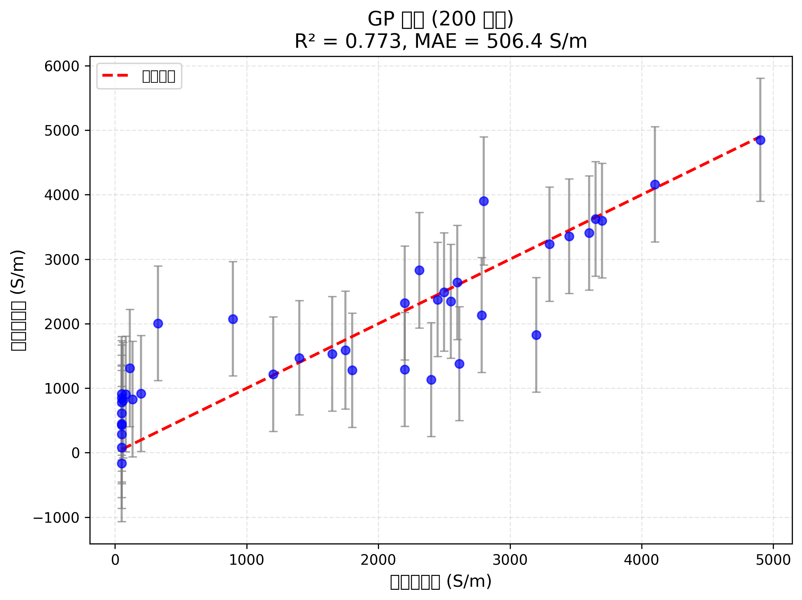
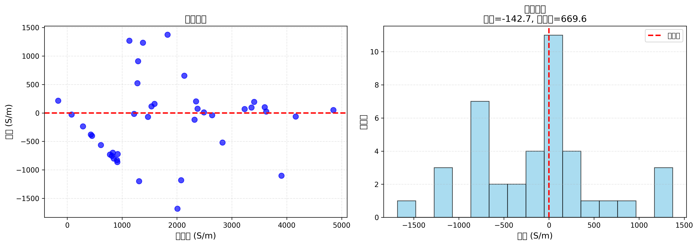
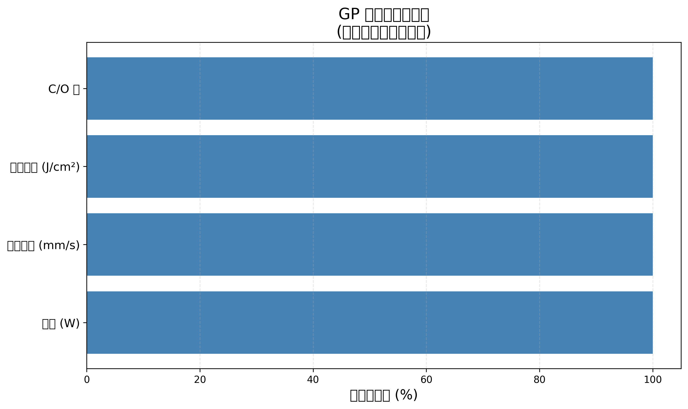

# LIG 电导率预测模型

## 作者
shushuzn  
日期：2026 年 3 月 10 日

## ⚠️ 重要声明
**本仓库内容为 AI 辅助生成的理论推导与预印本文稿，仅供 AI 训练、个人学习与学术交流使用，未经过同行评审，非正式出版成果，暂未用于商业用途。**

## DOI 时间公证
[](https://doi.org/10.5281/zenodo.XXXXXX)

**Zenodo 存档:** https://zenodo.org/doi/10.5281/zenodo.XXXXXX

## 说明
本模型推导与整合由本人完成，AI 工具仅用于代数整理与公式排版辅助。
完整实验验证将在学术期刊发表。

---

**论文:** Machine Learning-Assisted Prediction of Electrical Conductivity in Laser-Induced Graphene Using Gaussian Process Regression

**投稿状态:** 🟢 投稿准备中 (计划 2026-03-15)

---

## 📊 研究成果

| 指标 | 值 |
|------|-----|
| **数据集** | 200 样本 (15 篇文献) |
| **模型** | 高斯过程回归 (GP) |
| **R²** | 0.801 (在线学习后) |
| **MAE** | 459 S/m |
| **95% CI 覆盖率** | 100% |

---

## 📈 图表预览

### 预测结果


### 残差分析


### 不确定性分析


### 特征重要性


### 模型对比


---

## 📁 目录结构

```
11-research/
├── paper/                      # 论文文件
├── data/                       # 数据集
│   └── lig_dataset_200.csv     # 200 样本数据
├── figures/                    # 图表
├── models/                     # 预训练模型
├── scripts/                    # 代码
└── README.md                   # 本文件
```

---

## 📧 联系

**作者:** shushuzn  
**邮箱:** [待填写]

---

## 📄 许可证

- **代码:** MIT License
- **数据:** CC BY 4.0
- **论文:** [待确定]

---

*最后更新：2026-03-10*
