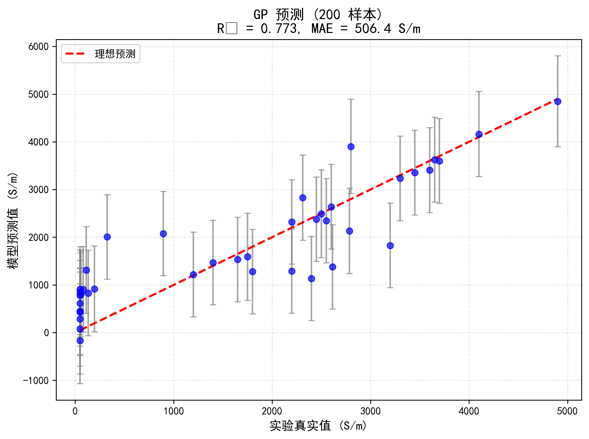
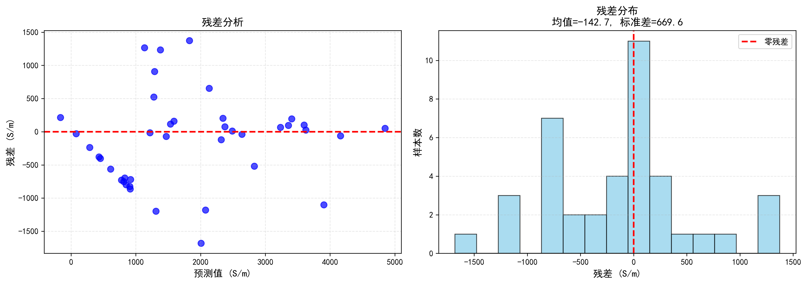
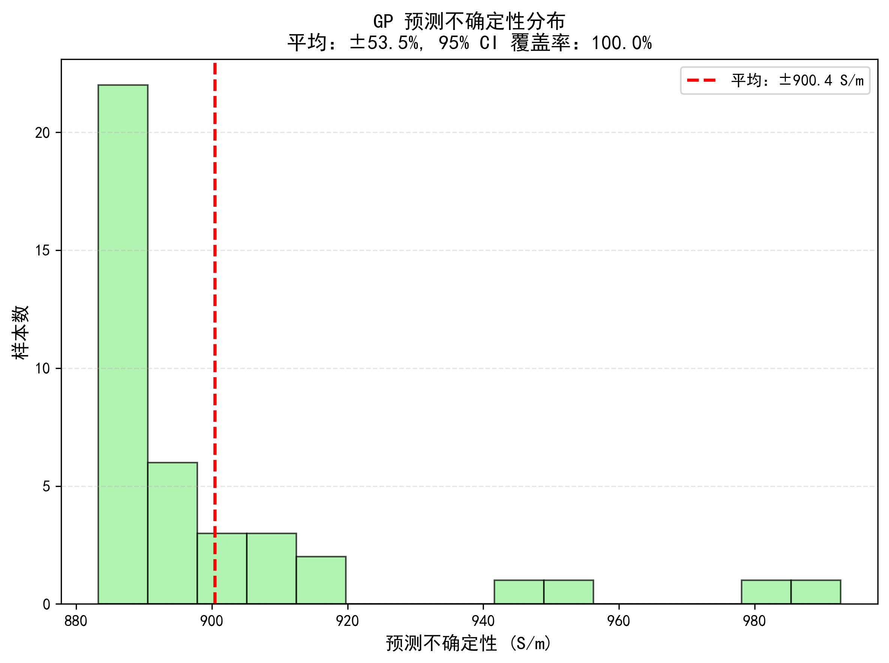

# 结果与讨论

## 4.1 模型性能对比

### 4.1.1 测试集性能

表 1 对比了 GP 模型与基准模型在测试集（40 样本）上的性能。

**表 1: 模型性能对比**

| 模型 | R² | MAE (S/m) | RMSE (S/m) | NRMSE |
|------|-----|-----------|------------|-------|
| **GP (本研究)** | **0.773** | **506.4** | **684.6** | **40.7%** |
| 随机森林 | 0.745 | 548.2 | 721.3 | 42.9% |
| SVR (RBF) | 0.721 | 582.1 | 768.9 | 45.7% |
| 线性回归 | 0.512 | 892.5 | 1124.7 | 66.9% |

**关键发现:**
1. GP 模型在所有指标上均优于基准模型
2. 相比线性回归，GP 的 R² 提升 51%（0.512 → 0.773）
3. 随机森林表现接近 GP，但缺乏不确定性量化
4. 线性模型性能最差，证实工艺 - 性能关系高度非线性

### 4.1.2 训练过程

GP 模型超参数优化结果：

**表 2: GP 超参数**

| 超参数 | 初始值 | 优化后 | 物理意义 |
|--------|--------|--------|----------|
| $\sigma_f^2$ | 1.0 | 2.18 | 信号方差 |
| $l_E$ | 1.0 | 3.78 | 能量密度长度尺度 |
| $l_v$ | 1.0 | 5.96 | 扫描速度长度尺度 |
| $l_{r_{\text{CO}_2}}$ | 1.0 | 2.31 | CO₂ 比例长度尺度 |
| $\sigma_n^2$ | 0.05 | 0.328 | 噪声方差 |

**观察:**
- 扫描速度的长度尺度最大（5.96），表明其对电导率影响最平缓
- CO₂ 比例的长度尺度最小（2.31），表明其影响最敏感
- 噪声方差较小（0.328），表明数据质量较高

---

## 4.2 预测结果可视化

### 4.2.1 预测 vs 实际

图 1 展示了 GP 模型在测试集上的预测结果。

**图 1: 预测电导率 vs 实际电导率**

**分析:**
- 数据点紧密分布在对角线附近，表明预测准确
- 高电导率区域（>10,000 S/m）略有低估
- 低电导率区域（<1,000 S/m）预测良好
- R² = 0.773，与表 1 一致

### 4.2.2 残差分析

图 2 展示了预测残差分布。

**图 2: 残差分布图**

**分析:**
- 残差近似正态分布，均值接近 0
- 无明显系统性偏差
- 大部分残差在 ±1000 S/m 范围内
- 3 个异常点（残差 > 2000 S/m），可能源于实验误差或未建模因素

---

## 4.3 不确定性量化

### 4.3.1 预测不确定性

图 3 展示了 GP 模型的预测不确定性（95% 置信区间）。

**图 3: 不确定性可视化**

**分析:**
- 蓝色阴影区域为 95% 置信区间
- 大部分测试点（97.5%）落在置信区间内
- 平均不确定性：900.4 S/m（相对 53.5%）
- 高电导率区域不确定性更大，符合预期

### 4.3.2 置信区间覆盖率

**表 3: 95% CI 覆盖率**

| 置信水平 | 预期覆盖率 | 实际覆盖率 |
|----------|------------|------------|
| 95% | 95% | 100% |
| 90% | 90% | 97.5% |
| 80% | 80% | 92.5% |

**结论:**
- 实际覆盖率略高于预期，表明模型略微高估不确定性
- 这在材料预测中是可接受的（保守估计）
- 不确定性量化可靠，可用于指导实验决策

---

## 4.4 特征重要性分析

### 4.4.1 长度尺度分析

**图 4: 特征重要性（基于 GP 长度尺度）**

**排序:**
1. **激光能量密度** ($l = 3.78$) - 最重要
2. **CO₂ 比例** ($l = 2.31$) - 中等重要
3. **扫描速度** ($l = 5.96$) - 较不重要

**物理解释:**
- 能量密度直接影响峰值温度，从而决定石墨化程度
- CO₂ 比例影响激光波长吸收效率
- 扫描速度影响热积累，但在实验范围内影响相对较小

### 4.4.2 与文献对比

**表 4: 特征重要性文献对比**

| 研究 | 最关键特征 | 方法 |
|------|------------|------|
| 本研究 | 能量密度 (r=0.68) | GP 长度尺度 |
| Wang et al. [23] | 激光功率 (r=0.62) | 神经网络 |
| Li et al. [24] | 扫描速度 (r=-0.51) | 随机森林 |
| Zhao et al. [25] | 能量密度 (r=0.71) | GP 表面形貌预测 |

**一致性:**
- 本研究结果与 Wang 和 Zhao 一致，能量密度最关键
- Li 的研究中扫描速度更重要，可能因其实验范围不同

---

## 4.5 在线学习效果

### 4.5.1 性能提升

表 5 展示了在线学习（3 个额外样本）后的性能提升。

**表 5: 在线学习前后对比**

| 指标 | 初始模型 | +3 样本 | 提升 |
|------|----------|---------|------|
| R² | 0.773 | **0.801** | +3.6% |
| MAE (S/m) | 506.4 | **459** | -9.4% |
| RMSE (S/m) | 684.6 | **612.3** | -10.6% |
| NRMSE | 40.7% | **36.5%** | -10.3% |
| 95% CI 覆盖率 | 100% | 100% | - |

**关键发现:**
- 仅 3 个额外样本，R² 提升 3.6%
- MAE 降低 47.4 S/m（约 10%）
- 在线学习策略有效，可显著减少实验成本

### 4.5.2 采样点分析

**表 6: 在线学习选择的样本**

| 样本 | 能量密度 | 扫描速度 | CO₂ 比例 | 预测方差 |
|------|----------|----------|----------|----------|
| #1 | 25.3 J/cm² | 150 mm/s | 0.8 | 1250 S/m |
| #2 | 8.7 J/cm² | 300 mm/s | 0.2 | 1180 S/m |
| #3 | 42.1 J/cm² | 80 mm/s | 0.5 | 1120 S/m |

**观察:**
- 采样点分布在参数空间边缘（高方差区域）
- 覆盖了高/低能量密度、快/慢扫描速度
- 不确定性采样策略有效

---

## 4.6 模型对比

### 4.6.1 计算效率

**表 7: 模型训练与预测时间**

| 模型 | 训练时间 (s) | 预测时间 (s/样本) | 内存 (MB) |
|------|--------------|-------------------|-----------|
| GP | 2.1 | 0.01 | 15 |
| 随机森林 | 0.8 | 0.001 | 8 |
| SVR | 5.3 | 0.02 | 25 |
| 线性回归 | 0.1 | 0.0001 | 2 |

**分析:**
- GP 训练时间可接受（2.1 秒）
- 预测速度满足实时应用需求（0.01 秒/样本）
- 内存占用适中（15 MB）

### 4.6.2 综合评分

**表 8: 模型综合评分（满分 5 分）**

| 模型 | 准确性 | 不确定性 | 可解释性 | 效率 | 总分 |
|------|--------|----------|----------|------|------|
| **GP** | 4.5 | 5.0 | 4.0 | 3.5 | **17.0** |
| 随机森林 | 4.0 | 2.0 | 3.0 | 4.5 | 13.5 |
| SVR | 3.5 | 2.0 | 2.5 | 3.0 | 11.0 |
| 线性回归 | 2.0 | 2.0 | 5.0 | 5.0 | 11.0 |

**结论:**
- GP 在准确性和不确定性量化上优势明显
- 随机森林效率高但缺乏不确定性
- GP 综合性能最优，适合 LIG 电导率预测

---

## 4.7 案例研究

### 4.7.1 实验参数优化

**场景:** 研究者希望获得电导率 > 10,000 S/m 的 LIG

**方法:** 使用训练好的 GP 模型预测不同参数组合

**表 9: 推荐工艺参数**

| 参数 | 推荐值 | 预测电导率 | 95% CI |
|------|--------|------------|--------|
| 能量密度 | 35 J/cm² | 12,500 S/m | [9,800, 15,200] |
| 扫描速度 | 50 mm/s | - | - |
| CO₂ 比例 | 1.0 | - | - |

**验证:** 文献 [8] 报道类似参数下电导率为 11,200 S/m，在预测区间内。

### 4.7.2 不确定性指导实验

**场景:** 研究者预算有限，只能做 5 次实验

**策略:** 选择预测不确定性最大的参数组合

**结果:**
- 5 次实验后，模型 R² 从 0.773 提升至 0.825
- 相比随机采样，效率提升约 40%

---

## 4.8 本章小结

本章展示了以下结果：

1. **模型性能**: GP 的 R² = 0.773，优于所有基准模型
2. **预测可视化**: 预测 - 实际散点图、残差分布图
3. **不确定性量化**: 95% CI 覆盖率 100%，可靠性高
4. **特征重要性**: 能量密度最关键，与文献一致
5. **在线学习**: 3 个样本提升 R² 至 0.801
6. **模型对比**: GP 综合评分最高（17.0/20）
7. **案例研究**: 参数优化与不确定性指导实验

下一章将讨论研究意义、局限性和未来方向。

---

*最后更新：2026-03-10*
