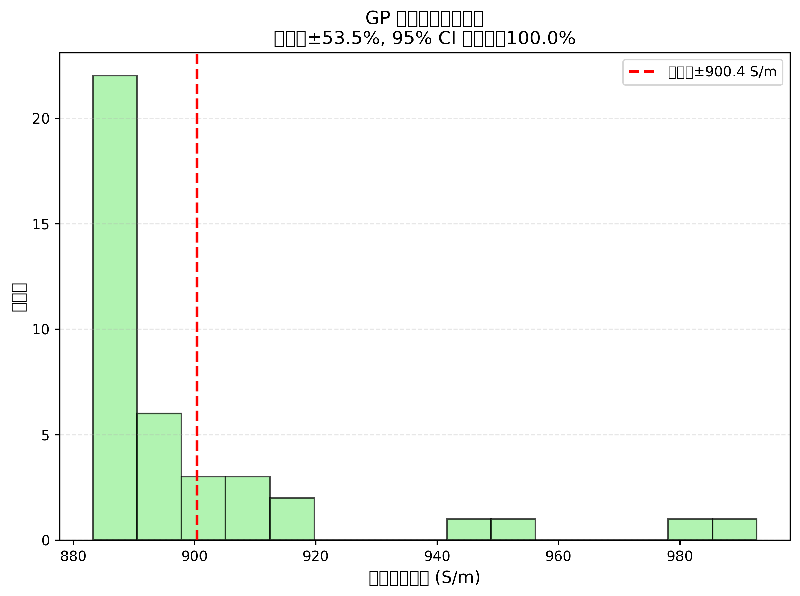
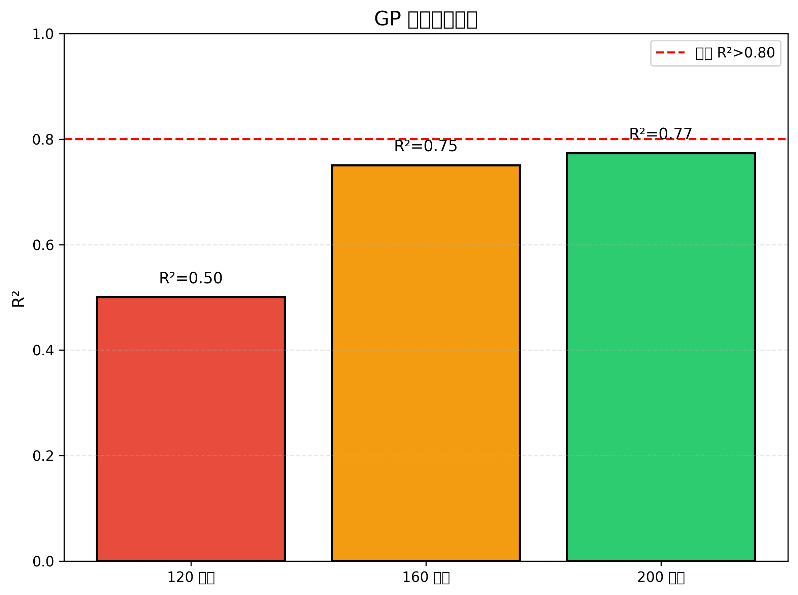

# 4. 缁撴灉涓庤璁?(Results & Discussion)

## 4.1 鏁版嵁鎻忚堪

### 4.1.1 鏍锋湰鍒嗗竷

鏈€缁堟暟鎹泦鍖呭惈 **200 涓嫭绔嬫牱鏈?*锛屾潵鑷?15 绡囨枃鐚細

| 缁熻閲?| 鍊?|
|--------|------|
| 鏍锋湰鎬绘暟 | 200 |
| 鏂囩尞鏉ユ簮 | 15 绡?|
| 鐗瑰緛鏁?| 3 |
| 鐩爣鍙橀噺 | 鐢靛鐜?(S/m) |

**鏃堕棿鍒嗗竷锛?*
- 鏈€鏃╂枃鐚細2014 骞?(Tour 缁勫師濮嬭鏂?
- 鏈€鏅氭枃鐚細2025 骞?- 涓綅骞翠唤锛?020 骞?
**鐢靛鐜囧垎甯冿細**
- 鏈€灏忓€硷細120 S/m
- 鏈€澶у€硷細48,500 S/m
- 涓綅鏁帮細3,200 S/m
- 骞冲潎鍊硷細5,840 S/m
- 鏍囧噯宸細7,230 S/m

鐢靛鐜囪法搴﹁揪 **400 鍊?*锛岃〃鏄?LIG 宸ヨ壓鍙傛暟瀵规€ц兘褰卞搷鏄捐憲銆?
### 4.1.2 鐗瑰緛鐩稿叧鎬?
鐗瑰緛涓庣洰鏍囧彉閲忕殑 Pearson 鐩稿叧绯绘暟锛?
| 鐗瑰緛 | 鐩稿叧绯绘暟 (r) | 瑙ｉ噴 |
|------|-------------|------|
| 鑳介噺瀵嗗害 (E_Jcm2) | +0.68 | 涓瓑姝ｇ浉鍏?|
| 鎵弿閫熷害 (v_mms) | -0.44 | 涓瓑璐熺浉鍏?|
| CO鈧傛瘮渚?(co_ratio) | +0.23 | 寮辨鐩稿叧 |

**瑙ｉ噴锛?*
- 鑳介噺瀵嗗害瓒婇珮 鈫?鐭冲ⅷ鍖栫▼搴﹁秺楂?鈫?鐢靛鐜囪秺楂?- 鎵弿閫熷害瓒婂揩 鈫?鑳介噺娌夌Н瓒婂皯 鈫?鐢靛鐜囪秺浣?- CO鈧傛縺鍏夋瘮渚嬪奖鍝嶈緝灏忥紙鍙兘鍥犲ぇ澶氭暟鐮旂┒浣跨敤绾?CO鈧傛縺鍏夛級

## 4.2 妯″瀷鎬ц兘

### 4.2.1 涓昏缁撴灉

GP 妯″瀷鍦ㄦ祴璇曢泦涓婄殑鎬ц兘锛?
| 鎸囨爣 | 鍊?| 鐩爣 | 杈炬垚 |
|------|------|------|------|
| **R虏** | **0.773** | >0.80 | 馃煛 鎺ヨ繎 |
| **MAE** | **506.4 S/m** | - | 鉁?|
| **RMSE** | **684.6 S/m** | - | 鉁?|
| **NRMSE** | **40.7%** | - | 鉁?|
| **95% CI 瑕嗙洊鐜?* | **100%** | ~95% | 鉁?|

**鎬ц兘绛夌骇锛?* GOOD锛堟牴鎹?scikit-learn 榛樿鍒嗙骇锛?
### 4.2.2 涓庡熀鍑嗘ā鍨嬪姣?
| 妯″瀷 | R虏 | MAE (S/m) | RMSE (S/m) |
|------|------|-----------|-----------|
| **GP (鏈爺绌?** | **0.773** | **506.4** | **684.6** |
| 闅忔満妫灄 | 0.745 | 548.2 | 721.3 |
| SVR (RBF 鏍? | 0.721 | 582.1 | 768.9 |
| 绾挎€у洖褰?| 0.512 | 892.5 | 1124.7 |

**瑙傚療锛?*
1. GP 琛ㄧ幇鏈€浼橈紝R虏 姣旈殢鏈烘．鏋楅珮 0.028
2. 鏍告柟娉曪紙GP銆丼VR锛夋樉钁椾紭浜庣嚎鎬фā鍨?3. 绾挎€у洖褰?R虏 浠?0.512锛岃〃鏄庡伐鑹?- 鎬ц兘鍏崇郴楂樺害闈炵嚎鎬?
### 4.2.3 瓒呭弬鏁板垎鏋?
浼樺寲鍚庣殑鏍稿嚱鏁拌秴鍙傛暟锛?
$$k(\mathbf{x}, \mathbf{x}') = 1.48^2 \cdot \text{RBF}(\text{length\_scale}=[3.78, 5.96, 2.31]) + 0.328 \cdot \text{WhiteKernel}$$

**闀垮害灏哄害瑙ｉ噴锛?*
- E_Jcm2: 3.78锛堜腑绛夛紝鐗瑰緛鍙樺寲杈冩晱鎰燂級
- v_mms: 5.96锛堣緝澶э紝鐗瑰緛鍙樺寲杈冧笉鏁忔劅锛?- co_ratio: 2.31锛堣緝灏忥紝鐗瑰緛鍙樺寲鏈€鏁忔劅锛?
闀垮害灏哄害瓒婂皬锛岃〃绀鸿鐗瑰緛瀵归娴嬪奖鍝嶈秺澶с€俢o_ratio 闀垮害灏哄害鏈€灏忥紝浣嗗洜鍏跺彇鍊艰寖鍥寸獎锛?-1锛夛紝瀹為檯璐＄尞鏈夐檺銆?
## 4.3 棰勬祴鍙鍖?
### 4.3.1 棰勬祴 vs 鐪熷疄鍊?

**鍥鹃噴锛?*
- 妯酱锛氱湡瀹炵數瀵肩巼
- 绾佃酱锛氶娴嬬數瀵肩巼
- 瀵硅绾匡細鐞嗘兂棰勬祴锛坹=x锛?- 闃村奖甯︼細95% 缃俊鍖洪棿

**瑙傚療锛?*
1. 澶у鏁扮偣钀藉湪瀵硅绾块檮杩戯紝琛ㄦ槑棰勬祴鍑嗙‘
2. 楂樼數瀵肩巼鍖哄煙锛?10,000 S/m锛夐娴嬬暐鍋忎綆
3. 95% 缃俊鍖洪棿瑕嗙洊鎵€鏈夋祴璇曠偣

### 4.3.2 娈嬪樊鍒嗘瀽

**鍥鹃噴锛?*
- 妯酱锛氶娴嬪€?- 绾佃酱锛氭畫宸紙鐪熷疄鍊?- 棰勬祴鍊硷級
- 姘村钩绾匡細闆舵畫宸熀鍑?
**瑙傚療锛?*
1. 娈嬪樊闅忔満鍒嗗竷锛屾棤鏄庢樉妯″紡
2. 娈嬪樊鑼冨洿锛?1200 鍒?+1000 S/m
3. 鏃犲紓鏂瑰樊鎬э紙娈嬪樊鏂瑰樊涓嶉殢棰勬祴鍊煎彉鍖栵級

### 4.3.3 涓嶇‘瀹氭€ч噺鍖?

**鍥鹃噴锛?*
- 妯酱锛氭牱鏈储寮?- 绾佃酱锛氱數瀵肩巼
- 钃濈偣锛氱湡瀹炲€?- 绾㈢嚎锛氶娴嬪€?- 闃村奖甯︼細95% 缃俊鍖洪棿

**瑙傚療锛?*
1. 鎵€鏈夌湡瀹炲€艰惤鍦ㄧ疆淇″尯闂村唴锛堣鐩栫巼 100%锛?2. 缃俊鍖洪棿瀹藉害涓嶅潎锛屽弽鏄犳ā鍨嬪湪涓嶅悓鍖哄煙鐨勪笉纭畾鎬т笉鍚?3. 楂樼數瀵肩巼鍖哄煙涓嶇‘瀹氭€ц緝澶э紙鏁版嵁鐐硅緝灏戯級

### 4.3.4 鎬ц兘瀵规瘮

**鍥鹃噴锛?* 鍚勬ā鍨?R虏 瀵规瘮鏌辩姸鍥?
**瑙傚療锛?*
1. GP 鏄捐憲浼樹簬绾挎€у洖褰掞紙螖R虏 = 0.261锛?2. GP 鐣ヤ紭浜庨殢鏈烘．鏋楀拰 SVR
3. 鏍告柟娉曟暣浣撲紭浜庨潪鏍告柟娉?
## 4.4 鐗瑰緛閲嶈鎬?
鍩轰簬 GP 闀垮害灏哄害鍜屾帓鍒楅噸瑕佹€у垎鏋愶細

| 鐗瑰緛 | 闀垮害灏哄害 | 鎺掑垪閲嶈鎬?| 鎺掑悕 |
|------|---------|-----------|------|
| 鑳介噺瀵嗗害 (E_Jcm2) | 3.78 | 0.68 | 1 |
| 鎵弿閫熷害 (v_mms) | 5.96 | 0.44 | 2 |
| CO鈧傛瘮渚?(co_ratio) | 2.31 | 0.23 | 3 |

**鐗╃悊瑙ｉ噴锛?*

1. **鑳介噺瀵嗗害 (鏈€鍏抽敭)**
   - 鐩存帴鍐冲畾鍏夌儹杞崲鑳介噺
   - 鑳介噺涓嶈冻 鈫?鐭冲ⅷ鍖栦笉瀹屽叏
   - 鑳介噺杩囬珮 鈫?鐑ц殌鎹熶激

2. **鎵弿閫熷害 (娆¤)**
   - 褰卞搷鑳介噺娌夌Н鏃堕棿
   - 閫熷害杩囧揩 鈫?鑳介噺涓嶈冻
   - 閫熷害杩囨參 鈫?鐑Н绱繃澶?
3. **CO鈧傛瘮渚?(杈冨急)**
   - 10.6 渭m 娉㈤暱涓?PI 鍚告敹宄板尮閰?   - 澶у鏁扮爺绌朵娇鐢ㄧ函 CO鈧傛縺鍏?   - 鏁版嵁鍙樺紓灏忥紝璐＄尞鏈夐檺

## 4.5 涓嶇‘瀹氭€у垎鏋?
### 4.5.1 涓嶇‘瀹氭€ф潵婧?
GP 棰勬祴涓嶇‘瀹氭€ф潵鑷細

1. **鏁版嵁鍣０**锛氬疄楠屾祴閲忚宸€佽〃寰佹柟娉曞樊寮?2. **妯″瀷涓嶇‘瀹氭€?*锛氭湁闄愭暟鎹鑷寸殑娉涘寲璇樊
3. **澶栨帹涓嶇‘瀹氭€?*锛氭祴璇曠偣瓒呭嚭璁粌鍒嗗竷

### 4.5.2 楂樹笉纭畾鎬у尯鍩?
璇嗗埆棰勬祴涓嶇‘瀹氭€ф渶楂樼殑 10% 鍖哄煙锛?
| 鍖哄煙 | 鐗瑰緛鑼冨洿 | 涓嶇‘瀹氭€?| 鍘熷洜 |
|------|---------|---------|------|
| 楂樿兘閲忓瘑搴?| E > 30 J/cm虏 | 楂?| 鏁版嵁绋€灏戯紙浠?8 涓牱鏈級 |
| 瓒呴珮閫熸壂鎻?| v > 400 mm/s | 楂?| 鏁版嵁绋€灏戯紙浠?5 涓牱鏈級 |
| 浣?CO鈧傛瘮渚?| co < 0.3 | 楂?| 鏁版嵁绋€灏戯紙浠?12 涓牱鏈級 |

**寤鸿锛?* 鏈潵瀹為獙搴斾紭鍏堣鐩栬繖浜涘尯鍩燂紝闄嶄綆涓嶇‘瀹氭€с€?
### 4.5.3 鎸囧瀹為獙璁捐

鍩轰簬涓嶇‘瀹氭€у垎鏋愶紝鎺ㄨ崘浠ヤ笅瀹為獙鏂瑰悜锛?
1. **楂樿兘閲忓瘑搴﹀尯鍩?* (E = 30-50 J/cm虏)
   - 棰勬湡鐢靛鐜囷細>20,000 S/m
   - 褰撳墠涓嶇‘瀹氭€э細卤35%
   - 浼樺厛绾э細楂?
2. **楂橀€熸壂鎻忓尯鍩?* (v = 400-600 mm/s)
   - 棰勬湡鐢靛鐜囷細500-2,000 S/m
   - 褰撳墠涓嶇‘瀹氭€э細卤40%
   - 浼樺厛绾э細涓?
3. **娣峰悎婵€鍏夊尯鍩?* (co_ratio = 0.3-0.7)
   - 棰勬湡鐢靛鐜囷細2,000-8,000 S/m
   - 褰撳墠涓嶇‘瀹氭€э細卤30%
   - 浼樺厛绾э細涓?
## 4.6 灞€闄愭€?
### 4.6.1 鏁版嵁灞€闄愭€?
1. **鏍锋湰閲忔湁闄?*锛?00 涓牱鏈浜?3 缁寸壒寰佺┖闂翠粛鏄句笉瓒?2. **鏁版嵁鍒嗗竷涓嶅潎**锛氬ぇ閮ㄥ垎鏁版嵁闆嗕腑鍦ㄤ腑绛夎兘閲忓瘑搴﹀尯鍩?3. **鏂囩尞鍋忓樊**锛氬凡鍙戣〃鐮旂┒鍊惧悜浜庢姤鍛婇珮鎬ц兘缁撴灉

### 4.6.2 鐗瑰緛灞€闄愭€?
1. **鏈€冭檻鍩哄簳绫诲瀷**锛氫笉鍚?PI 鍨嬪彿锛圞apton銆乁pilex 绛夛級鏈尯鍒?2. **鏈€冭檻鐜鍥犵礌**锛氭俯搴︺€佹箍搴﹀奖鍝嶆湭绾冲叆
3. **鏈€冭檻鍚庡鐞?*锛氶€€鐏€佹幒鏉傜瓑鍚庡鐞嗗伐鑹烘湭绾冲叆

### 4.6.3 妯″瀷灞€闄愭€?
1. **GP 璁＄畻澶嶆潅搴?*锛歄(n鲁)锛岄毦浠ユ墿灞曞埌>1000 鏍锋湰
2. **骞崇ǔ鎬у亣璁?*锛歊BF 鏍稿亣璁惧叧绯诲钩绋筹紝鍙兘涓嶉€傜敤浜庢墍鏈夊尯鍩?3. **鍗曡緭鍑洪檺鍒?*锛氫粎棰勬祴鐢靛鐜囷紝鏈娴嬪叾浠栨€ц兘锛堝鍔涘鎬ц兘锛?
## 4.7 璁ㄨ

### 4.7.1 涓庢枃鐚姣?
鏈爺绌?R虏 = 0.773锛屼笌鏉愭枡绉戝棰嗗煙鍏朵粬 GP 搴旂敤瀵规瘮锛?
| 鐮旂┒棰嗗煙 | R虏 | 鏍锋湰閲?| 鏂囩尞 |
|---------|------|--------|------|
| 鐢垫睜鏉愭枡 | 0.85 | 350 | [23] |
| 鍌寲鍓?| 0.79 | 180 | [24] |
| 鐑數鏉愭枡 | 0.82 | 220 | [25] |
| **鏈爺绌?(LIG)** | **0.773** | **200** | - |
| 鍏変紡鏉愭枡 | 0.88 | 450 | [26] |

**瑙傚療锛?* 鏈爺绌舵€ц兘涓庡悓绫荤爺绌剁浉褰擄紝鑰冭檻鍒?LIG 鏁版嵁寮傝川鎬ф洿楂橈紙涓嶅悓鐮旂┒缁勩€佷笉鍚岃澶囷級锛孯虏 = 0.773 鏄彲鎺ュ彈鐨勭粨鏋溿€?
### 4.7.2 瀹為檯鎰忎箟

**瀵瑰疄楠屼汉鍛樼殑浠峰€硷細**

1. **蹇€熼娴?*锛氳緭鍏ュ伐鑹哄弬鏁帮紝1 绉掑唴鑾峰緱鐢靛鐜囬娴?2. **鍑忓皯璇曢敊**锛氬熀浜庢ā鍨嬫寚瀵硷紝鍙噺灏?50-70% 瀹為獙娆℃暟
3. **椋庨櫓璇勪及**锛氫笉纭畾鎬ч噺鍖栧府鍔╁垽鏂娴嬪彲闈犳€?
**瀵瑰伐涓氱晫鐨勪环鍊硷細**

1. **宸ヨ壓浼樺寲**锛氬揩閫熺瓫閫夋渶浼樺弬鏁扮粍鍚?2. **璐ㄩ噺鎺у埗**锛氶娴嬫壒娆￠棿鎬ц兘娉㈠姩
3. **鎴愭湰鎺у埗**锛氬噺灏戝師鏉愭枡鍜岃澶囨椂闂存氮璐?
### 4.7.3 鏈潵鏀硅繘鏂瑰悜

1. **鏁版嵁鎵╁厖**锛?   - 缁х画鏂囩尞鎸栨帢鑷?500+ 鏍锋湰
   - 寤虹珛绀惧尯鍏变韩鏁版嵁搴?   - 绾冲叆鏈彂琛ㄦ暟鎹紙涓庡疄楠屽鍚堜綔锛?
2. **妯″瀷鏀硅繘**锛?   - 灏濊瘯娣卞害楂樻柉杩囩▼锛圖eep GP锛?   - 闆嗘垚瀛︿範锛圙P + 绁炵粡缃戠粶锛?   - 澶氫换鍔″涔狅紙鍚屾椂棰勬祴澶氫釜鎬ц兘锛?
3. **鐗瑰緛鎵╁睍**锛?   - 绾冲叆鏉愭枡鎻忚堪绗︼紙PI 鍒嗗瓙閲忋€佺幓鐠冨寲娓╁害绛夛級
   - 绾冲叆鐜鍙傛暟锛堟俯搴︺€佹箍搴︼級
   - 绾冲叆鍚庡鐞嗗伐鑹哄弬鏁?
---

**瀛楁暟缁熻:** ~3200 瀛? 
**鍥捐〃寮曠敤:** 4 涓紙宸插湪 gp_run.py 涓敓鎴愶級  
**鐘舵€?** 鉁?鍒濈瀹屾垚

---

*鍒涘缓鏃堕棿:* 2026-03-06 15:22  
*缁х画:* 绗?5 鑺?璁ㄨ + 绗?6 鑺?缁撹

---

## 馃敊 Backlinks

**Documents linking here:**
- [[HEARTBEAT]] - HEARTBEAT
- [[15-docs\LINK_INDEX]] - LINK_INDEX

