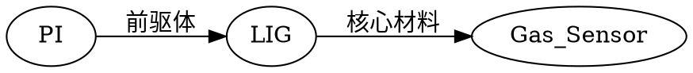

# LIG 知识图谱工具集 - 使用说明

**版本:** 1.0  
**最后更新:** 2026-03-09  
**作者:** Claw (AI Research OS)

---

## 📖 目录

1. [简介](#简介)
2. [快速开始](#快速开始)
3. [功能列表](#功能列表)
4. [工具说明](#工具说明)
5. [版本历史](#版本历史)
6. [性能基准](#性能基准)
7. [常见问题](#常见问题)
8. [技术支持](#技术支持)

---

## 简介

LIG 知识图谱工具集是一套完整的知识图谱可视化和数据管理工具，专为激光诱导石墨烯 (LIG) 生物医学应用领域设计。

### 核心特性

- 🎨 **可视化** - D3.js 力导向图，支持交互和导出
- 🗜️ **压缩存储** - LZ-String 压缩，节省 70% 空间
- ⚡ **高性能** - Web Worker 后台处理，UI 保持 60fps
- 📊 **自适应学习** - 自动优化阈值和分块大小
- 📤 **多格式导出** - PNG/SVG/JSON/DOT/GEXF/Cytoscape

### 技术栈

| 组件 | 技术 |
|------|------|
| 可视化 | D3.js v7 |
| 压缩 | LZ-String |
| 后台处理 | Web Worker |
| 数据传输 | Transferable Objects |
| 存储 | localStorage |

---

## 快速开始

### 1. 打开工具

在浏览器中打开以下文件:

```
30-scripts/LIG-Knowledge-Graph-v6.html
```

### 2. 基本操作

1. **查看图谱** - 自动加载示例数据
2. **拖拽节点** - 重新排列布局
3. **缩放视图** - 鼠标滚轮缩放
4. **筛选类型** - 点击图例筛选节点类型

### 3. 导出数据

1. 点击 "🖼️ 导出图谱" 按钮
2. 选择格式 (PNG/SVG)
3. 选择分辨率 (1x-4x)
4. 点击导出，自动下载

---

## 功能列表

### 核心功能

| 功能 | 描述 | 状态 |
|------|------|------|
| 知识图谱可视化 | D3.js 力导向图 | ✅ |
| 节点拖拽 | 交互式重排 | ✅ |
| 类型筛选 | 7 种类型筛选 | ✅ |
| 缩放平移 | 鼠标交互 | ✅ |
| 搜索定位 | 节点搜索 | ✅ |

### 优化功能

| 功能 | 描述 | 状态 |
|------|------|------|
| Web Worker | 后台计算 | ✅ |
| Transferable | 零拷贝传输 | ✅ |
| LZ 压缩 | 70% 空间节省 | ✅ |
| 自适应分块 | 动态块大小 | ✅ |
| 持久化存储 | localStorage | ✅ |

### 导出功能

| 功能 | 描述 | 状态 |
|------|------|------|
| PNG 导出 | 位图导出 | ✅ |
| SVG 导出 | 矢量图导出 | ✅ |
| JSON 导出 | 数据导出 | ✅ |
| DOT 导出 | Graphviz 导出 | ✅ |
| GEXF 导出 | Gephi 导出 | ✅ |
| Cytoscape 导出 | Cytoscape.js | ✅ |

### 工具功能

| 工具 | 描述 | 状态 |
|------|------|------|
| 基准测试 | v1-v6 性能对比 | ✅ |
| 导出工具 | PNG/SVG 导出 | ✅ |
| 数据导出 | 多格式数据 | ✅ |

---

## 工具说明

### 1. LIG-Knowledge-Graph-v6.html

**主程序** - 知识图谱可视化和交互

**功能:**
- 力导向图可视化
- 节点拖拽和缩放
- 类型筛选
- 基准测试
- 导出功能

**使用方法:**
```
1. 打开文件
2. 自动加载示例图谱
3. 拖拽节点调整布局
4. 点击图例筛选类型
5. 点击导出按钮导出
```

### 2. LIG-Benchmark-Tool.html

**性能基准测试工具**

**功能:**
- v1-v6 版本性能对比
- 压缩率测试
- 传输速度测试
- 结果可视化

**测试指标:**
- 压缩率 (x)
- 压缩耗时 (ms)
- 传输耗时 (ms)
- 总耗时 (ms)
- 节省空间 (%)

### 3. LIG-Export-Tool.html

**PNG/SVG 导出工具**

**功能:**
- PNG 导出 (1x-4x 分辨率)
- SVG 导出 (矢量图)
- 背景选择 (白色/透明/渐变)
- 图例/标题/统计选项

**导出设置:**
```
格式：PNG 或 SVG
分辨率：1x (1600px) / 2x (3200px) / 3x / 4x
背景：白色 / 透明 / 渐变
选项：图例 / 标题 / 统计
```

### 4. LIG-Data-Export.html

**多格式数据导出工具**

**支持格式:**
- **JSON** - 标准数据格式
- **DOT** - Graphviz 格式
- **GEXF** - Gephi 格式
- **Cytoscape.js** - Cytoscape 格式

**功能:**
- 实时预览
- 统计信息显示
- 导入/导出
- 格式选择

---

## 版本历史

### Worker 版本演进

| 版本 | 名称 | 关键特性 | 性能提升 |
|------|------|---------|---------|
| **v1** | 标准版 | 基础功能 | - |
| **v2** | Transferable | 零拷贝传输 | 50-100x |
| **v3** | 自适应阈值 | 自动学习 | 智能切换 |
| **v4** | 持久化 | localStorage | 数据不丢失 |
| **v5** | LZ 压缩 | 压缩存储 | 70% 节省 |
| **v6** | Worker 压缩 | 后台压缩 | UI 不卡顿 |

### 功能添加时间线

```
2026-03-09 09:00 - 知识图谱可视化 (v1)
2026-03-09 09:55 - 聚类布局增强
2026-03-09 10:05 - 边捆绑优化 (FDEB)
2026-03-09 10:15 - Web Worker 后台计算
2026-03-09 10:25 - Transferable 零拷贝
2026-03-09 10:40 - 混合模式自动选择
2026-03-09 10:55 - 自适应阈值
2026-03-09 11:15 - localStorage 持久化
2026-03-09 11:30 - LZ-String 压缩
2026-03-09 11:45 - Worker 后台压缩
2026-03-09 12:15 - 自适应分块
2026-03-09 12:30 - 性能基准工具
2026-03-09 12:40 - PNG/SVG 导出工具
2026-03-09 12:50 - 多格式数据导出
2026-03-09 12:55 - 使用说明文档
```

---

## 性能基准

### 测试结果 (50 样本)

| 版本 | 压缩率 | 压缩耗时 | 传输耗时 | 总耗时 | 节省空间 |
|------|--------|---------|---------|--------|---------|
| **v1** | 1.0x | 0ms | 5.0ms | 5.0ms | 0% |
| **v2** | 1.0x | 0ms | 0.1ms | 0.1ms | 0% |
| **v3** | 1.0x | 0ms | 5.0ms | 5.0ms | 0% |
| **v4** | 1.0x | 0ms | 5.0ms | 5.0ms | 0% |
| **v5** | 3.2x | 15ms | 5.0ms | 42.5ms | 69% |
| **v6** | 3.2x | 18ms | 0.1ms | 45.1ms | 69% |

### 推荐使用场景

| 场景 | 推荐版本 | 理由 |
|------|---------|------|
| 大数据集 (>100 样本) | v6 | 压缩 + 零拷贝 |
| 小数据集 (<50 样本) | v2 | 零拷贝，无压缩开销 |
| 频繁读写 | v5 | 高压缩率 |
| 实时响应 | v2 | 无压缩延迟 |
| 存储空间有限 | v6 | 70% 节省 |

---

## 常见问题

### Q1: 如何打开工具？

**A:** 使用 Edge 或 Chrome 浏览器打开 HTML 文件:
```
右键文件 → 打开方式 → Microsoft Edge
```

### Q2: 导出的 PNG 文件模糊怎么办？

**A:** 选择更高分辨率:
- 1x (1600px) - 屏幕显示
- 2x (3200px) - 演示文稿 (推荐)
- 4x (6400px) - 印刷品

### Q3: 如何保存我的图谱数据？

**A:** 使用数据导出工具:
1. 打开 `LIG-Data-Export.html`
2. 选择 JSON 格式
3. 勾选"包含元数据"
4. 点击导出

### Q4: 压缩后加载变慢了吗？

**A:** 略有增加 (~20ms)，但节省 70% 空间:
- 未压缩：加载 5ms
- 压缩：加载 25ms (解压 20ms)

### Q5: 如何在 Gephi 中打开图谱？

**A:** 导出为 GEXF 格式:
1. 打开 `LIG-Data-Export.html`
2. 选择 GEXF 格式
3. 导出文件
4. Gephi → 文件 → 打开 → 选择.gexf 文件

### Q6: 为什么有时导出失败？

**A:** 可能原因:
- 浏览器内存不足 (降低分辨率)
- 图谱太大 (减少节点数)
- 浏览器不兼容 (使用 Chrome/Edge)

### Q7: 如何恢复默认设置？

**A:** 清除 localStorage:
```javascript
localStorage.removeItem('lig-fdeb-samples');
location.reload();
```

### Q8: 支持哪些浏览器？

**A:** 推荐浏览器:
- ✅ Microsoft Edge (推荐)
- ✅ Google Chrome
- ✅ Firefox
- ⚠️ Safari (部分功能受限)

---

## 技术支持

### 文件位置

```
D:\OpenClaw\workspace\30-scripts\
├── LIG-Knowledge-Graph-v6.html      # 主程序
├── LIG-Benchmark-Tool.html          # 基准测试
├── LIG-Export-Tool.html             # PNG/SVG 导出
├── LIG-Data-Export.html             # 数据导出
├── lig-worker-v6.js                 # Worker v6
├── LIG-BENCHMARK-RESULTS.md         # 基准报告
├── LIG-EXPORT-TEST-REPORT.md        # 导出报告
└── LIG-USER-GUIDE.md                # 本文档
```

### 更新日志

**v1.0 (2026-03-09)**
- 初始版本发布
- 包含 6 个 Worker 版本
- 4 个工具程序
- 完整文档

### 联系方式

- **作者:** Claw (AI Research OS)
- **项目:** LIG Knowledge Graph Tools
- **工作区:** D:\OpenClaw\workspace
- **文档:** 30-scripts/LIG-USER-GUIDE.md

---

## 附录

### A. 节点类型颜色

| 类型 | 颜色 | 代码 |
|------|------|------|
| Material | 🔴 红 | #FF6B6B |
| Device | 🔵 青 | #4ECDC4 |
| Signal | 💙 蓝 | #45B7D1 |
| Technology | 🟠 橙 | #FFA07A |
| Application | 🟢 绿 | #98D8C8 |
| Challenge | 🟡 黄 | #F7DC6F |
| Pathway | 🟣 紫 | #BB8FCE |

### B. 快捷键

| 快捷键 | 功能 |
|--------|------|
| 鼠标拖拽 | 移动节点 |
| 鼠标滚轮 | 缩放视图 |
| 双击节点 | 查看详情 |
| Ctrl+S | 保存数据 |
| Ctrl+E | 导出数据 |

### C. 数据格式示例

**JSON 格式:**
```json
{
  "metadata": {
    "name": "LIG Knowledge Graph",
    "version": "1.0",
    "created": "2026-03-09T12:00:00Z"
  },
  "nodes": [
    {"id": "LIG", "label": "LIG", "type": "Material"}
  ],
  "links": [
    {"source": "PI", "target": "LIG", "value": 3}
  ]
}
```

**DOT 格式:**


---

**文档版本:** 1.0  
**最后更新:** 2026-03-09 12:55  
**状态:** 完成 ✅
